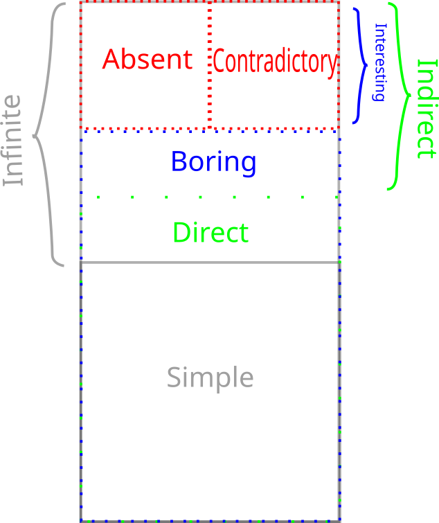

---
tags:
  - subchapter
---
# 3. A New Categorization of Idealization

Focusing on the discussion of infinite idealizations solely, I believe 4 (maybe 5) distinctions can be drawn. I will first present the distinctions, and then show how I believe they are ordered. The goal is to create categories for (infinite) idealizations to facilitate reasoning and argument, since, as we have seen above, Norton and Strevens are not per se arguing over the same definition, even if it is close.

### Simple vs. Infinite Idealizations

Strevens -- and Norton less explicitly -- present this distinction as the main point of contention, but it actually concerns only a subclass of infinite idealizations we shall discuss below. However, the simple vs. infinite distinction is a useful one, but I will draw it slightly differently than Strevens does.

1) _Simple Idealization_.
   A simple idealization is an idealization in which no limit is taken in order to set the relevant parameter.
2) _Infinite Idealization_.
   An infinite idealization is one in which a limit is taken in order to set a parameter.

Note that no reference has been made to whether or not it affects another parameter, or whether the limiting operation is successful. I argue that this is first and foremost the distinction between these idealizations, and that other qualities should be discussed separately. [^1]

This is a distinction based on _method_: _how_ is the idealization achieved? The idealized system might end up the same in some cases, but the operation is the relevant piece.

### Direct vs. Indirect Idealizations

This distinction is also due to Strevens, although he does not discuss it separately and makes it co-refering(?) with the first distinction. Direct idealizations, as the name implies, directly alter the relevant parameter e.g. setting air resistance to zero in order to have zero air resistance.  Indirect idealizations on the other hand, alter a parameter in order to alter the actually relevant parameter, e.g. infinite population in order to set genetic drift to zero, or infinite particles in order to achieve a singularity.

This is a distinction based on _goal_: _what_ should the idealization achieve? Indirect idealizations are sometimes necessary in order to get rid of a pesky parameter. Note that while this is an intention based distinction, in some models the same parameter might be set directly or indirectly. While in Newtonian Mechanics we might set the air resistance to zero directly, in a more complete QFT description of the same situation we have no access to such a parameter.

Also note that this distinction is not the same as the one between infinite and simple idealizations: as Strevens notes, it is completely in the realm of possibility to directly set a parameter to zero using an infinite limiting operation, "but you would merely be showing off."

Additionally, while only infinite idealizations can be indirect, not all are.

### Unproblematic/boring vs. problematic/interesting

(not sure what to call this yet, should be catchy)
This distinction is both due to Strevens and Norton, and is what I believe the main distinction we ought to discuss. This distinction is only relevant for **indirect infinite** idealizations, as both Norton and Strevens agree that all direct and simple idealizations provide little puzzlement. Indirect infinite idealizations can be boring i.e. there is no mismatch with the idealized system and the target system (I have no example), or interesting, by creating such a mismatch. All the idealizations under discussion fall under this category.

This is a distinction based on _result_: _what_ is the idealization like? (Not too sure about this characterization, not very catchy)

### Absent vs. Contradictory

(also unsure about these names) 
(other idea self-contradictory and "external"-contradictory? extracontradictory?)
This distinction is due to Norton, as Strevens does not explicitly distinguish between the two. This distinction only concerns **interesting idealizations**. For absent idealizations, the idealized model system simply cannot exist in its own terms: an infinite sphere does not denote anything. Contradictory idealizations, on the other hand, postulate some property of the model system which conflicts with another property we hold to be incontrovertible, or at least uncontroversial. Most of the idealizations under discussion fall under this category: infinite populations are not self contradictory, but they prevent probabilistic reasoning using uniform distributions.

This is a distinction based on ???

### Putative distinctions

There are two more distinctions of which I am not sure I can genuinely draw them.

#### Quantitative vs qualitative mismatch/contradiction.

*Quantitative*

Here I mean Norton's ellipsoid elongating to a cylinder: the mismatch comes from the ellipsoid having a certain volume/surface ratio in all finite stages, but a different one when infinitely long. No property is set to zero or infinity, unless you count "cylinderness".

*Qualitative*

Some property becomes true or false in the infinite limit which is not false or true in the finite case. Most of the actual examples are here: having or not having phase transitions, being 2D or 3D, exhibiting or not exhibiting an effect.

The reason I doubt this distinction is that I feel like it's a question of framing. A very important question, which I should investigate, but not a distinction of kind per se.

#### Logical/transcendental contradiction vs a physical/intuitive contradiction.

Strevens uses the example of the infinite population idealization in evolutionary biology to exemplify the former: the main problem is that for an infinite population it is no longer possible to have countable additivity with a uniform distribution, and so you cannot use the Strong Law of Large Numbers and could not say anything about the probability of genetic drift (might be badly paraphrasing): the method itself is no longer useful, but it's not a direct self-contradiction as the infinite sphere, as an infinite population is a sensible concept. The latter is a bit more vague, but here I mean e.g. the thermodynamic limit: it does not work because it stipulates an infinite number of particles. However, this is in conflict with the whole idea that the world consists of molecules. BUT not directly so, as [@Shech2013] points out, it is only a real paradox if we stipulate that statistical mechanics in the thermodynamic limit is a true/accurate representation of the world, which we need to justify by e.g. (or i.e.? I don't know of any others) an indispensability argument.

This is a distinction based on????

I doubt this because the former category might refer to the same as “absent” idealizations.

### Order of the distinctions

I think the order is best explained by this beautiful diagram, the entire box being “idealization-space”. Not included is how this is linked to approximations, nor the distinctions I am unsure about, this is simply to show how the above distinctions relate to each other

	

		

			

				
Simple

			

			
Direct

		

		
Boring

	

	

		
absent

		
contradictory

	

[^1]: (I am not sure whether idealizations can be split up neatly into two disjoint sets like these (I'm not sure if that can be done at all, see [@WEBER2010]), but i'll just treat it like it does)  